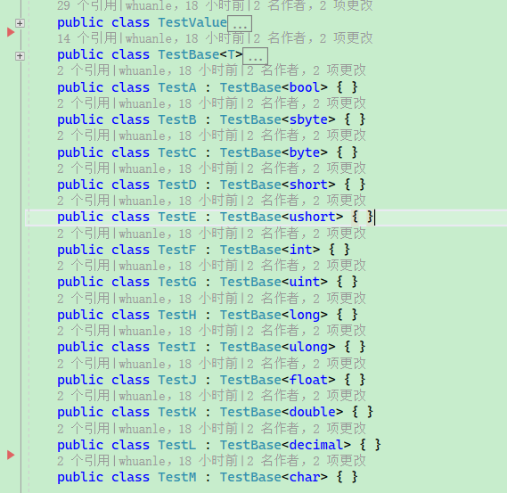

# Maomi.Mapper

注：本项目用于教学目的，性能较差，请勿用于生产环境。

MaomiMapper 是一个使用表达式树构造生成对象成员映射的框架，即对象映射框架。

虽然 MaomiMapper 性能不啥样，但是代码注释也写得很齐全，适合读者研究反射、表达式树、类型转换等代码。


MaomiMapper 与  AutoMapper 对比：

| Method        |      Mean |    Error |   StdDev |   Gen0 | Allocated |
| ------------- | --------: | -------: | -------: | -----: | --------: |
| ASAutoMapper  | 146.30 ns | 1.759 ns | 1.645 ns | 0.0362 |     304 B |
| ASMaomiMapper | 817.46 ns | 6.467 ns | 6.049 ns | 0.0935 |     784 B |
| ASDelegate    | 668.56 ns | 5.050 ns | 4.724 ns | 0.0839 |     704 B |
| _AutoMapper   |  67.56 ns | 0.438 ns | 0.410 ns | 0.0191 |     160 B |
| _MaomiMapper  | 242.03 ns | 0.751 ns | 0.702 ns | 0.0315 |     264 B |
| _Delegate     | 188.64 ns | 1.251 ns | 1.109 ns | 0.0267 |     224 B |

> AS 开头的方法表示有类型转换。

测试使用的模型类：

```csharp
	public class TestValue
	{
		public bool ValueA { get; set; } = true;
		public sbyte ValueB { get; set; } = 1;
		public byte ValueC { get; set; } = 2;
		public short ValueD { get; set; } = 3;
		public ushort ValueE { get; set; } = 4;
		public int ValueF { get; set; } = 5;
		public uint ValueG { get; set; } = 6;
		public long ValueH { get; set; } = 7;
		public ulong ValueI { get; set; } = 8;
		public float ValueJ { get; set; } = 9;
		public double ValueK { get; set; } = 10;
		public decimal ValueL { get; set; } = 11;
		public char ValueM { get; set; } = (Char)12;
	}
	public class TestB
	{
		public bool ValueA { get; set; } = true;
		public sbyte ValueB { get; set; } = 1;
		public byte ValueC { get; set; } = 2;
		public short ValueD { get; set; } = 3;
		public ushort ValueE { get; set; } = 4;
		public int ValueF { get; set; } = 5;
		public uint ValueG { get; set; } = 6;
		public long ValueH { get; set; } = 7;
		public ulong ValueI { get; set; } = 8;
		public float ValueJ { get; set; } = 9;
		public double ValueK { get; set; } = 10;
		public decimal ValueL { get; set; } = 11;
		public char ValueM { get; set; } = (Char)12;
	}
	public class TestBase<T>
	{
		public T ValueA { get; set; }
		public T ValueB { get; set; }
		public T ValueC { get; set; }
		public T ValueD { get; set; }
		public T ValueE { get; set; }
		public T ValueF { get; set; }
		public T ValueG { get; set; }
		public T ValueH { get; set; }
		public T ValueI { get; set; }
		public T ValueJ { get; set; }
		public T ValueK { get; set; }
		public T ValueL { get; set; }
	}

	public class TestC : TestBase<int> { }

	public class TestD
	{
		public bool ValueA { get; set; } = true;
		public sbyte ValueB { get; set; } = 1;
		public byte ValueC { get; set; } = 2;
		public short ValueD { get; set; } = 3;
		public ushort ValueE { get; set; } = 4;
		public int ValueF { get; set; } = 5;
		public uint ValueG { get; set; } = 6;
		public long ValueH { get; set; } = 7;
		public ulong ValueI { get; set; } = 8;
		public float ValueJ { get; set; } = 9;
		public double ValueK { get; set; } = 10;
		public decimal ValueL { get; set; } = 11;
		public char ValueM { get; set; } = (Char)12;
	}
```


### 快速使用 MaomiMapper

MaomiMapper 框架的使用比较简单，示例如下：

```csharp
var maomi = new MaomiMapper();
maomi
    .Bind<TestValue, TestB>()
    .Bind<TestValue, TestC>()
    .Bind<TestValue, TestD>();

maomi.Map<TestValue, TestD>(new TestValue());
```


### 配置

在映射对象时，可以配置映射逻辑，比如碰到成员是对象时，是否开辟新对象，是否映射私有成员等。

使用方法如下：

```csharp
        var mapper = new MaomiMapper();
        mapper.Bind<TestA, TestB>(option =>
        {
            option.IsObjectReference = false;
        }).Build();
```

> 每个类型映射都可以单独配置一个 MapOption。


MapOption 类型：

```csharp
	/// <summary>
	/// 映射配置
	/// </summary>
	public class MapOption
	{
		/// <summary>
		/// 包括私有字段
		/// </summary>
		public bool IncludePrivate { get; set; } = false;

		/// <summary>
		/// 自动映射，如果有字段/属性没有配置映射规则，则自动映射
		/// </summary>
		public bool AutoMap { get; set; } = true;

		/// <summary>
		/// 如果属性字段是对象且为相同类型，则保持引用。 <br />
		/// 如果设置为 false，则会创建新的对象，再对字段逐个处理。
		/// </summary>
		public bool IsObjectReference { get; set; } = true;

		/// <summary>
		/// 配置时间转换器。<br />
		///  如果 b.Value 是 DateTime，而 a.Value 不是 DateTime，则需要配置转换器，否则会报错。
		/// </summary>
		/// <value></value>
		public Func<object, DateTime>? ConvertDateTime { get; set; }
	}
```


### 自动扫描

MaomiMapper 支持扫描程序集中的对象映射，有两种方法可以配置。


第一种方法是使用特性类，标识该类型可以转换为何种类型。

如下代码所示，TestValueB 标识了其可以映射为 TestValueA 类型。

```csharp
	public class TestValueA
	{
		public string ValueA { get; set; } = "A";

		public string ValueB { get; set; } = "B";

		public string ValueC { get; set; } = "C";
	}

	[Map(typeof(TestValueA), IsReverse = true)]
	public class TestValueB
	{
		public string ValueA { get; set; }

		public string ValueB { get; set; }

		public string ValueC { get; set; }
	}
```


第二种方法是实现 IMapper，在文件中配置映射规则。

```csharp
	public class MyMapper : IMapper
	{
		public override void Bind(MaomiMapper mapper)
		{
			mapper.Bind<TestA, TestC>(option => option.IsObjectReference = false);
			mapper.Bind<TestA, TestD>(option => option.IsObjectReference = false);
		}
	}
```


此外，可以继承实现 MapOptionAttribute 特性，然后附加到类型中，在扫描程序集映射时，框架会自动配置。

```csharp
	[AttributeUsage(AttributeTargets.Class, AllowMultiple = false, Inherited = false)]
	public class MyMapOptionAttribute : MapOptionAttribute
	{
		public override Action<MapOption> MapOption => _option;
		private Action<MapOption> _option;
		public MyMapOptionAttribute()
		{
			_option = option =>
			{
				option.IsObjectReference = false;
			};
		}
	}

	[MyMapOption]
	[Map(typeof(TestB), IsReverse = true)]
	public class TestA
	{
		public string ValueA { get; set; } = "A";

		public string ValueB { get; set; } = "B";

		public string ValueC { get; set; } = "C";
		public TestValueA Value { get; set; }
	}
```


### 配置字段映射

可以使用 `.Map` 配置一个字段的映射规则。

```csharp
maomi
    .Bind<TestValue, TestB>()
    .Map(a => a.ValueC + 1, b => b.ValueC).Build()
```

相当于：

```
b.ValueC = a.ValueC + 1
```


如果有私有字段需要映射，可以使用名称字段。

```csharp
    public class TestD
    {
        public string ValueA { get; set; }
        public string ValueB;
        private string ValueC { get; set; }
        private string ValueD;
    }

    public class TestDD
    {
        public string ValueA { get; set; }
        public string ValueB;
        public string ValueC { get; set; }
        public string ValueD;
    }
```

```csharp
        var mapper = new MaomiMapper();
        var build = mapper.Bind<TestC, TestD>(
            option =>
            {
                option.IncludePrivate = true;
            })
            .Map(a => "111", b => "ValueC")
            .Build();
        mapper.Bind<TestC, TestDD>().Build();
```

相当于：

```
b.ValueC = "111"
```


在配置映射时，可以调用 `Build()` 方法，自动映射其它字段或属性。比如开发者只配置了 `.ValueA` 属性，未配置 `ValueB`、`ValueC` 等，则调用 `Build()` 时，框架会补全其它属性对应的映射。如果未配置，框架则在第一次使用对象映射时自动调用。

如果需要反向映射，可以使用 `BuildAndReverse()`。

```csharp
           .BuildAndReverse(option =>
			{
				option.IsObjectReference = false;
			});
```


可以忽略字段映射。

```csharp
				// b.V = a.V + "a"
				.Map(a => a.V + "a", b => b.V)
				// 忽略 V1
				.Ignore(x => x.V1)
				// b.V2 = a.V
				.Map(a => a.V, b => "V2")
				// b.V3 = "666";
				.Map(a => "666", b => "V3")
				.Build();
```


### 对象映射

有以下模型类：

```csharp
    public class TestValue
    {
        public string ValueA { get; set; } = "A";

        public string ValueB { get; set; } = "B";

        public string ValueC { get; set; } = "C";
    }

    public class TestA
    {
        public TestValue Value { get; set; }
    }
    public class TestB
    {
        public TestValue Value { get; set; }
    }
```


TestA 和 TestB 类型中，均有 TestValue 类型的属性，框架默认使用引用赋值，示例：

```cs
testB.Value = testA.Value
```

两个对象的 Value 属性引用了同一个对象。

如果需要开辟新的实例，可以使用：

```csharp
        var mapper = new MaomiMapper();
        mapper.Bind<TestA, TestB>(option =>
        {
            // 开辟新的实例
            option.IsObjectReference = false;
        }).Build();
```


如果两者的 Value 属性是不同类型对象，则框架也会自动映射。如：

```csharp
    public class TestA
    {
        public TestValueA Value { get; set; }
    }
    public class TestB
    {
        public TestValueB Value { get; set; }
    }
```


TestValueA、TestValueB 均为对象类型时，框架会自动映射下一层。


### 数组和集合映射

MaomiMapper 只能处理相同类型的数组，并且使用直接赋值的方法。

```csharp
		public class TestA
		{
			public int[] Value { get; set; }
		}
		public class TestB
		{
			public int[] Value { get; set; }
		}
```

```csharp
			var mapper = new MaomiMapper();
			mapper.Bind<TestA, TestB>(option =>
			{
				option.IsObjectReference = true;
			}).BuildAndReverse(option =>
			{
				option.IsObjectReference = false;
			});

			var a = new TestA
			{
				Value = new[] { 1, 2, 3 }
			};
			var b = mapper.Map<TestA, TestB>(a);
```


MaomiMapper 可以处理大多数集合，除了字典等类型。


处理相同类型的集合：

```csharp
		public class TestC
		{
			public List<int> Value { get; set; }
		}
		public class TestD
		{
			public List<int> Value { get; set; }
		}
```

```csharp
			var mapper = new MaomiMapper();
			mapper.Bind<TestC, TestD>(option =>
			{
				option.IsObjectReference = false;
			}).Build();

			var a = new TestA
			{
				Value = new[] { 1, 2, 3 }
			};
			var b = mapper.Map<TestA, TestB>(a);
```

相当于：

```csharp
d.Value = new List<int>();
d.Value.AddRange(c.Value);
```


也可以处理不同类型的集合：

```csharp
		public class TestE
		{
			public List<int> Value { get; set; }
		}
		public class TestF
		{
			public IEnumerable<int> Value { get; set; }
		}
		public class TestG
		{
			public HashSet<int> Value { get; set; }
		}
```

```csharp
			var mapper = new MaomiMapper();
			mapper.Bind<TestE, TestF>(option =>
			{
				option.IsObjectReference = false;
			}).Build();

			var a = new TestE
			{
				Value = new List<int> { 1, 2, 3 }
			};
			var b = mapper.Map<TestE, TestF>(a);
```

以上 TestE、TestF、TestG 均可互转。


### 值类型互转

框架支持以下类型自动互转。

```csharp
Boolean
SByte
Byte
Int16
UInt16
Int32
UInt32
Int64
UInt64
Single
Double
Decimal
Char
```




支持任何类型自动转换为 string，但是不支持 string 转换为其它类型。

对于时间类型的处理，可以手动配置转换函数：

```csharp
	public class TestA
	{
		public string Value { get; set; }
	}
	public class TestB
	{
		public DateTime Value { get; set; }
	}

	[Fact]
	public void AS_Datetime()
	{
		var mapper = new MaomiMapper();
		mapper.Bind<TestA, TestB>(option =>
		{
            // 配置转换函数
			option.ConvertDateTime = value =>
			{
				if (value is string str)
					return DateTime.Parse(str);
				throw new Exception("未能转换为时间");
			};
		}).Build();
		var date = DateTime.Now;
		var a = mapper.Map<TestA, TestB>(new TestA()
		{
			Value = date.ToString()
		});

		Assert.Equal(date.ToString("yyyy/MM/dd HH:mm:ss"), a.Value.ToString("yyyy/MM/dd HH:mm:ss"));
	}
```


